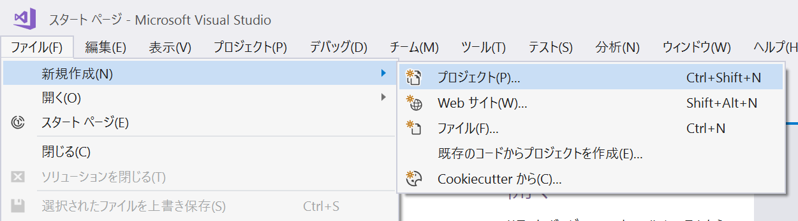
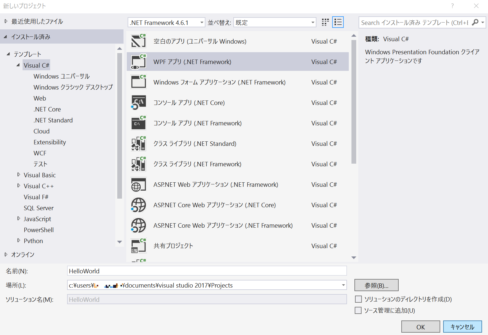
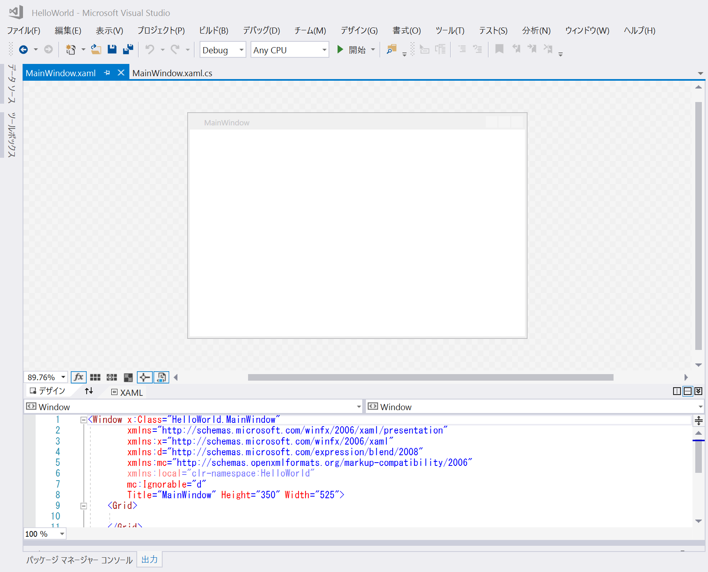
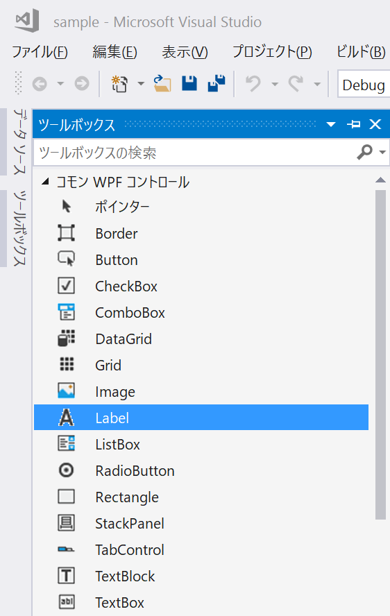
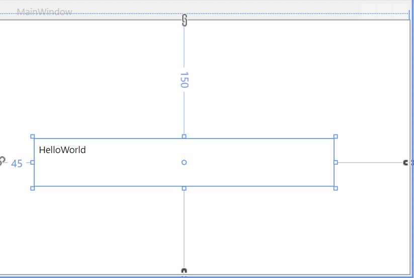
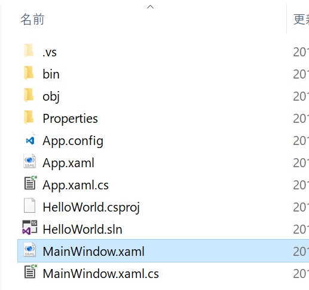
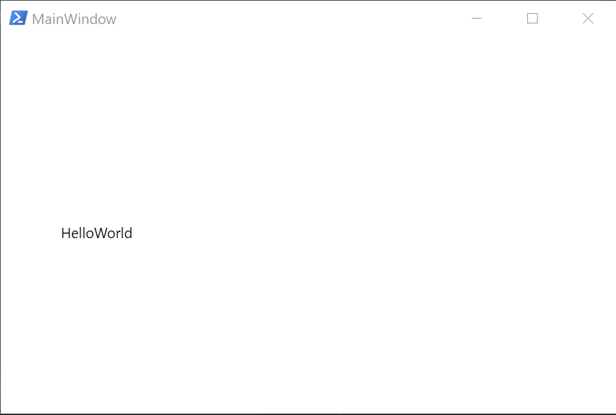
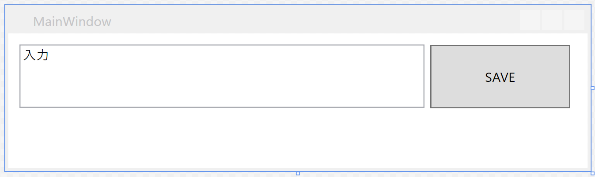
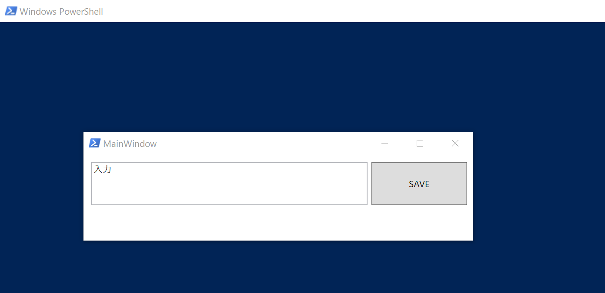
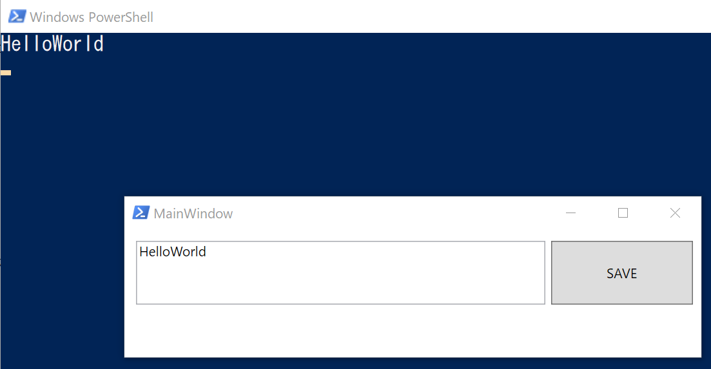

# 🔰Powreshell + WPF XAML でGUIを作成してみる

## 🔰概要

Powreshellでスクリプトを作っている時。

ちょっとGUIをつけたい。

そんな時に.NetのWindowsFormsクラスを呼び出してやっても良いのですが。
PowershellでWPF（Windows Presentation Foundation）をXAMLで使ってみたい。

というわけでやってみた。

今回XAMLを生成するのにVisual Studio 2017を使用してます。XAMLを手書きできる気合の入ってる方。もしくは他のエディタでという人は一部読み飛ばして下さい。

なんかもう素直にC#でいけば……と思わないことも無いのですが、Powershellでやりたいという熱い思いを大切にしたい。

## 🔰作業環境

- Windows10
- visual studio community 2017(XAMLを作る所だけで利用)
- Powershell部分はお好きなエディタでコーディングして下さい

VS2017は公式サイトより各自の状況にあったエディションをダウンロードしてインストールして下さい。

- [Visual Studio](https://www.microsoft.com/ja-jp/dev/default.aspx)

今回は個人のお勉強用なのでcommunity版を選択してインストール。

ちなみにVisualStudioの有償拡張機能に

- [PowerShell Pro Tools for Visual Studio 2017 trial](https://marketplace.visualstudio.com/items?itemName=AdamRDriscoll.PowerShellProToolsforVisualStudio2017)

PowershellでWPFなデザイナーというやりたいことズバリな機能があるようですが、有償なので今回はパス。

## 🔰C#のWPFテンプレートを使ってXAMLを生成する

ファイル -> 新規作成　プロジェクト



WPFアプリを選択



こんな感じでMainWindow.xamlのデザイナーに画面で表示されて、エディタの方にXAMLが表示されています。



ツールボックスからラベルを選択



適当にラベルを配置して、contentにHelloWorldと入力して保存する。



プロジェクトのフォルダの中に、MainWindow.xamlが出てきていますのでこれを使っていきます。



## 🔰作成したMainWindow.xamlを利用してPowershellでGUI表示

作成してMainWindows.xamlは下記の用になっている。

```xml
<Window x:Class="HelloWorld.MainWindow"
        xmlns="http://schemas.microsoft.com/winfx/2006/xaml/presentation"
        xmlns:x="http://schemas.microsoft.com/winfx/2006/xaml"
        xmlns:d="http://schemas.microsoft.com/expression/blend/2008"
        xmlns:mc="http://schemas.openxmlformats.org/markup-compatibility/2006"
        xmlns:local="clr-namespace:HelloWorld"
        mc:Ignorable="d"
        Title="MainWindow" Height="350" Width="525">
    <Grid>
        <Label x:Name="label" Content="HelloWorld" HorizontalAlignment="Left" VerticalAlignment="Top" Margin="45,150,0,0" Height="60" Width="378"/>

    </Grid>
</Window>
```

作成したXAMLを読み込むPowershellは下記のようにコーディングする。

```Powershell
PROCESS {

    #presentationframeworkを読み込み
    Add-Type -AssemblyName presentationframework

    #XAMLファイルを読み込んでxmlに変換
    [xml]$xaml = Get-Content .\MainWindow.xaml

    #Powershellで読み込む時に不要な要素を削除
    $xaml.window.RemoveAttribute("x:Class")
    $xaml.window.RemoveAttribute("mc:Ignorable")

    #読み込んだxamlをXmlNodeReaderにキャスト
    $xamlReader = $xaml -as "System.Xml.XmlNodeReader"

    #Windows.Markup.XamlReaderで読み込み
    $mainWindow = [Windows.Markup.XamlReader]::Load($xamlReader)

    #表示
    $mainWindow.showDialog() | out-null

}

```

流れとしては

1. presentationframeworkを読み込み
1. 先程作ったXAMLファイルを読み込み
1. Powershellで利用する時の不要な要素を削除
1. Windows.Markup.XamlReaderで読み込めるようにSystem.Xml.XmlNodeReaderにキャストして
1. Windows.Markup.XamlReaderに読み込み
1. showDialogで表示

以上が一連の流れになります。

コードの中で

>#Powershellで読み込む時に不要な要素を削除
>$xaml.window.RemoveAttribute("x:Class")
>$xaml.window.RemoveAttribute("mc:Ignorable")

となっている部分については。Visual Studioはフォーム要素に名前をつけると、"x:"要素とかXAMLに書いたりするけれど、Powershellだと適切に解釈ができないようで消しています。

- [Integrating XAML into PowerShell](https://blogs.technet.microsoft.com/platformspfe/2014/01/20/integrating-xaml-into-powershell/)

ここらへんを参考にしました。

実行するとこのようにGUIが表示される。



## 🔰sampleプログラムの作成

入力ボックスに入力されている値をボタンを押した時に取得するSAMPLE。



こんな感じでテキストボックスとボタンのフォームを作成して保存。

生成されるMainWindow.xamlを利用する。

```xml
<Window x:Class="sample.MainWindow"
        xmlns="http://schemas.microsoft.com/winfx/2006/xaml/presentation"
        xmlns:x="http://schemas.microsoft.com/winfx/2006/xaml"
        xmlns:d="http://schemas.microsoft.com/expression/blend/2008"
        xmlns:mc="http://schemas.openxmlformats.org/markup-compatibility/2006"
        xmlns:local="clr-namespace:sample"
        mc:Ignorable="d"
        Title="MainWindow" Height="150" Width="525">
    <Grid Margin="0,0,5,0">
        <Button x:Name="Button" Content="SAVE" HorizontalAlignment="Left" Height="57" Margin="378,10,0,0" VerticalAlignment="Top" Width="126" RenderTransformOrigin="0.377,0.488"/>
        <TextBox x:Name="TextBox" HorizontalAlignment="Left" Height="57" TextWrapping="Wrap" Text="入力" VerticalAlignment="Top" Width="363" Margin="10,10,0,0"/>

    </Grid>
</Window>
```

Powershellの部分

```Powershell
PROCESS {

    #ボタンクリック時
    function ButtonClick {
        $input = $mainWindow.FindName('TextBox').Text
        Write-Host $input
    }

    #presentationframeworkを読み込み
    Add-Type -AssemblyName presentationframework

    #XAMLファイルを読み込んでxmlに変換
    [xml]$xaml = Get-Content .\MainWindow.xaml

    #Powershellで読み込む時に不要な要素を削除
    $xaml.window.RemoveAttribute("x:Class")
    $xaml.window.RemoveAttribute("mc:Ignorable")

    #読み込んだXAMLをXmlNodeReaderにキャスト
    $xamlReader = $xaml -as "System.Xml.XmlNodeReader"

    #Windows.Markup.XamlReaderで読み込み
    $mainWindow = [Windows.Markup.XamlReader]::Load($xamlReader)

    # イベントハンドラ
    $mainWindow.FindName("Button").add_Click({ ButtonClick })

    #表示
    $mainWindow.showDialog() | Out-Null

}

```

実行すると



テキストボックスに何か入力してSAVEボタンを押すと



テキストボックスに入力されている値を取得してwrite-hostで出力する。

HelloWorldの時との差異はイベントハンドラとしてクリック時の動作を記載したのと、その時に呼び出すfunctionを書いた部分になります。

## 🔰総評

WPFとXAMLって触る前は何者という感じでしたが、実際に触ると最低限使えるくらいはなんとかなるみたいです。
